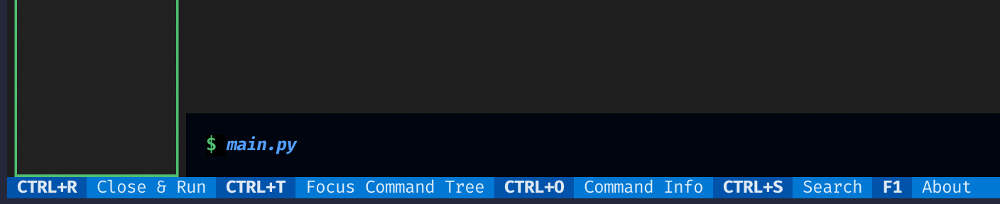
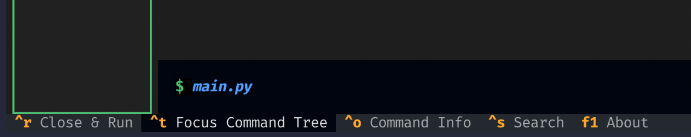

# Trogon is broken on Textual 0.63.0 and above

On Textual 0.63.0 and above, the footer in Trogon is no longer functional.
The **Close and Run** option and the **About** option still work, but other options don't respond to keyboard shortcuts or clicks.

Textual 0.63.0 [changed the footer behavior](https://github.com/Textualize/textual/pull/4537), which may be related.

Downgrading to Textual 0.62.0 restores the functionality.
Visually, you can discern whether an application is using the old or the new footer based on the visual display as well:

**Before**

**After**

## Instructions

1. Clone this repository
1. Create a virtual environment
1. Install the requirements (e.g. `./.venv/bin/python -m pip install -r requirements.txt`)
1. Run the TUI (e.g. `./.venv/bin/python main.py tui`)
1. Attempt to use the commands in the footer, and observe several don't work
1. Downgrade Textual to 0.62.0 (e.g. `./.venv/bin/python -m pip install textual==0.62.0`)
1. Run the TUI again
1. Observe the display is different and that all commands work as expected
